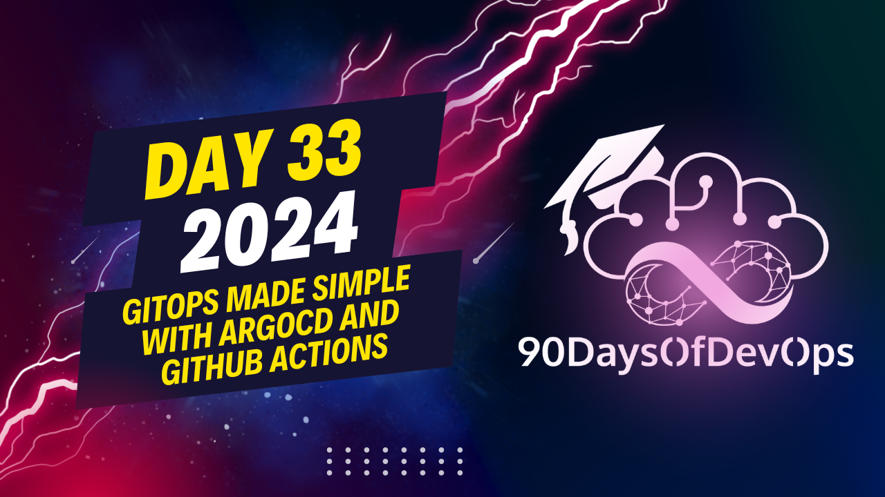

# Day 33 - GitOps made simple with ArgoCD and GitHub Actions

So you've set up a GitHub action workflow to build, tag, and push Docker images to Docker Hub based on changes in the `main.go` file, and then use Argo CD to manage the application deployment. This flow helps bridge the gap between developers and platform engineers by using GitOps principles.

Here are the benefits of using GitOps:

1. Version control history: By storing your manifest in a git repo, you can see how your application deployments and manifests have evolved over time, making it easy to identify changes that may have caused issues.
2. Standardization and governance: Using GitOps with Argo CD ensures that everything is standardized and governed by a repository acting as a gateway to the cluster for interacting with deployments. This gives platform engineers control over how things get changed in a centralized manner.
3. Security: By requiring developers to make pull requests on the repo before changes can be applied to the cluster, you can maintain security without giving kubernetes access to developers or people changing things in PRs. You can even run CI tests on the same repo before merging the PR.
4. Faster deployments: Once you've set up a GitOps pipeline, you can automate the entire deployment cycle and ship changes faster while maintaining security, standardization, and governance.

You mentioned that there is still some dependency on manually clicking "sync" in Argo CD UI; however, you can configure Argo CD to automatically apply changes whenever it detects them. You can also reduce the detection time for Argo CD to pull the repo more frequently if needed.

For more detailed steps and additional resources, you can check out the blog on your website (AR sharma.com) or find the GitHub repo used in this demo in the blog post. Thank you for watching, and I hope this was helpful! If you have any questions, please feel free to reach out to me on Twitter or LinkedIn.
The topic is specifically discussing GitHub Actions and Argo CD. The speaker explains how to use these tools to automate the deployment of applications by leveraging version control systems like Git.

The key takeaways from this session are:

1. **Identity**: Each commit in the GitHub repository is associated with a unique SHA (Secure Hash Algorithm) value, which serves as an identifier for the corresponding image tag.
2. **Purpose**: The purpose of using GitHub Actions and Argo CD is to automate the deployment process, ensuring that changes are properly tracked and deployed efficiently.

The speaker then presents the benefits of this setup:

1. **Version Control History**: By storing the manifest in a Git repository, you can see how your application deployments and manifests have evolved over time.
2. **Standardization and Governance**: Argo CD provides control and visibility into how changes are made, ensuring that everything is standardized and governed.
3. **Security**: You don't need to give Kubernetes access to developers or people who are pushing to prod; instead, they can make pull requests on the repo, which Argo CD monitors for security.
4. **Faster Shipping**: Once you set up a GitHub Actions pipeline, you can automate all of that part, reducing manual intervention and increasing efficiency.

The speaker concludes by emphasizing the value that GitHub Actions and Argo CD bring to organizations, allowing them to ship fast, keep things secure and standardized, and bridge the gap between developers and platform engineers.

Extra Resources which would be good to include in the description:
•	Blog: https://arshsharma.com/posts/2023-10-14-argocd-github-actions-getting-started/
•	GitHub repo used for the sample: https://github.com/RinkiyaKeDad/gitops-sample
•	Argo CD docs for installation: https://argo-cd.readthedocs.io/en/stable/operator-manual/installation/
