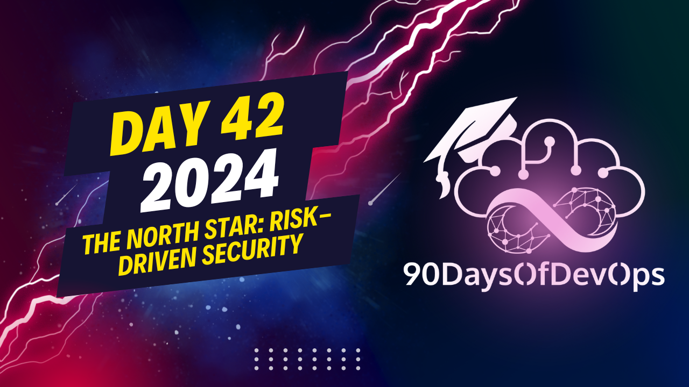

# Day 42 - The North Star: Risk-driven security

 In summary, the speaker is discussing the importance of threat modeling in software development. Here are the key points:

1. Threat modeling helps capture the good work already done in security, claim credit for it, and motivate teams. It also accurately reflects the risk by capturing controls that are already in place.
2. Business risks should also be considered in threat modeling. Standards and frameworks like AWS Well-Architected, CIS, or NIST can serve as guides.
3. Cyber Threat Intelligence (CTI) can be useful but has limitations: it focuses on technology and tells you what has already happened rather than what will happen. Therefore, it should be used cautiously in threat modeling.
4. Threat models should be simple yet reflect reality to make them effective communications tools for different audiences within an organization.
5. Threat models need to be kept up-to-date to accurately represent the current risk landscape and avoid misrepresenting the risks to the business. Outdated threat models can become a security weakness.

The speaker also encourages developers to try threat modeling on their projects and offers resources for learning more about threat modeling, such as Adam Shostack's book "Threat Modeling."
Here is the summarized content:

The speaker, Johnny Ties, emphasizes the importance of simplicity in threat modeling. He warns against using CTI (Cyber Threat Intelligence) as a strong indicator of risk, highlighting its limitations and tendency to change frequently. Johnny stresses that threat models should be easy to build, talk about, and read.

**KEY TAKEAWAYS**

1. **Simplicity**: The key to effective threat modeling is simplicity. It helps everyone involved in the process.
2. **Use it as a Communications tool**: View your threat model as a way to communicate with stakeholders, not just technical teams.
3. **Keep it up-to-date**: Threat models that are not kept current can be an Achilles heel and misrepresent risks.

**ADDITIONAL POINTS**

* Johnny encourages viewers to try threat modeling with their team and invites feedback.
* He mentions Adam Shac's book on threat modeling, which is a great resource for those interested in learning more about the topic.
