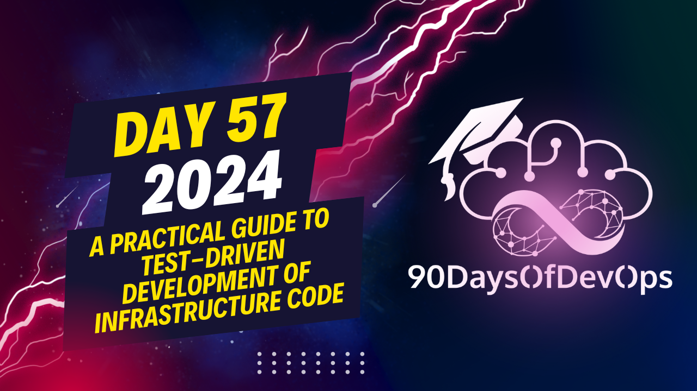

# Day 57 - A practical guide to Test-Driven Development of infrastructure code

A session describing a CI/CD pipeline in GitHub Actions that uses various tools such as Terraform, Bicep, Azure Policies (PS Rule), Snyk, and Pester to validate the security, compliance, and functionality of infrastructure code before deploying it to the actual environment. Here's a summary of the steps you mentioned:

1. Run tests locally using tools like Terraform, Bicep, and Azure Policies (PS Rule) before committing the code. This ensures that the changes are secure, compliant, and follow best practices.
2. In the CI/CD pipeline, use a workflow file in GitHub to combine these tests. The workflow includes jobs for linting, validation using pre-flight validation with ARM deploy action, running Azure Policies (PS Rule), Snyk, and Pester tests.
3. Use the built-in GitHub actions to run these tests in the pipeline. For example, use the Azure PS rule action to assert against specific Azure Policy modules, provide input path, output format, and file name.
4. Approve the test results before deploying changes to the environment. This ensures that it is safe to push the deploy button.
5. After deployment, run tests to verify if the deployment succeeded as intended, and if deployed resources have the right properties as declared in the code. Use tools like BenchPress (based on Pasta) or Pester to call the actual deployed resources and assert against their properties.
6. Optionally, use infrastructure testing tools such as smoke tests to validate the functionality of the deployed resources (e.g., a website).
7. To make it easier to install and configure these tools, consider using a Dev Container in Visual Studio Code. This allows you to define what tools should be pre-installed in the container, making it easy to set up an environment with all the necessary tools for developing infrastructure code.

Overall, this is a great approach to ensure that your infrastructure code is secure, compliant, and functional before deploying it to the actual environment. Thanks for sharing this valuable information!

1. **Azure DevOps**: The speaker discussed using Azure Pipelines to automate infrastructure testing and deployment.
2. **Security Testing**: They mentioned using Snak to run security tests in a continuous integration pipeline, allowing for automated testing and deployment.
3. **Deployment**: The speaker emphasized the importance of testing and verifying the actual deployment before pushing changes to production.
4. **Testing Types**: They introduced three types of tests: unit tests (Pester), infrastructure tests (BenchPress or Pesto), and smoke tests.
5. **Dev Container**: The speaker discussed using a Dev Container in Visual Studio Code to pre-configure and pre-install tools for developing Azure infrastructure code.

These key takeaways summarize the main topics and ideas presented by the speaker:

* Automating infrastructure testing and deployment with Azure Pipelines
* Leveraging Snak for security testing in CI pipelines
* Emphasizing the importance of verifying actual deployments before pushing changes to production
* Introducing different types of tests (unit, infrastructure, smoke) for ensuring the quality of infrastructure code
* Utilizing Dev Containers in Visual Studio Code to streamline development and deployment processes
